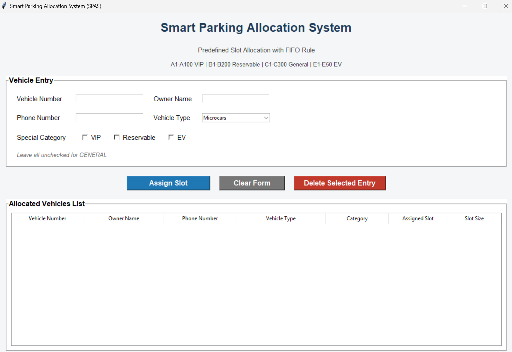

# Smart Parking Allocation System (SPAS)

## Abstract

Smart Parking Allocation System (SPAS) is an Artificial Intelligence mini project developed for the course **Computational Foundations for Artificial Intelligence**. The project models parking slot allocation as an AI problem and integrates problem formulation, search-based candidate selection, constraint satisfaction, utility-based decision making, uncertainty-aware reasoning, and explainable outputs into a single academic workflow.

The system assigns parking slots to vehicles based on slot availability, vehicle size, special category, and allocation constraints. The implementation is designed for submission quality, with a structured codebase, GUI-based interaction, clear module separation, and professional documentation.

## Project overview

SPAS is designed to automate parking slot allocation in a structured and explainable way. Instead of manually assigning a vehicle to any free position, the system evaluates slot validity using parking rules and AI logic.

The project is aligned to the CO1 to CO6 structure of the course and adapts the academic AI pipeline to a real parking allocation problem. All course outcomes are covered in the project through parking-domain implementation, with strongest coverage in problem formulation, CSP-based allocation, and integrated explainable pipeline execution.

## Key objectives

- Formulate parking allocation as an AI problem.
- Represent vehicles, slots, parking rules, and categories clearly.
- Apply candidate exploration and search reasoning.
- Validate assignments using CSP-based logic.
- Support utility-oriented selection among valid slots.
- Extend the system with uncertainty-aware reasoning.
- Produce clean outputs and explainable traces for academic evaluation.

## Modules covered

### `vehicle.py`

Defines the vehicle model and stores vehicle-related properties such as type, size, and category.

### `slot.py`

Defines parking slot attributes such as slot ID, size, availability, reservation status, and EV charging support.

### `parking.py`

Represents the parking structure and manages predefined parking slot groups.

### `constraints.py`

Implements allocation validity rules including size compatibility, category restrictions, and slot availability checks.

### `solver.py`

Handles slot search and assignment logic by finding valid candidates for allocation.

### `decision.py`

Implements the decision layer used to select the most suitable slot among valid candidates.

### `summary.py`

Generates readable summaries of allocation decisions and final results.

### `utils.py`

Contains helper functions used across modules.

### `visualization.py`

Supports output presentation or data visualization for result interpretation.

### `gui.py`

Provides the graphical user interface for entering vehicle details, applying category logic, assigning slots, and viewing allocation results.

### `main.py`

Acts as the main execution entry point for the project.

### `pipeline.py`

Integrates the overall AI workflow across the modules for end-to-end execution.

## Academic mapping

### CO1: Problem formulation and representation

SPAS models parking allocation using entities such as slots, vehicles, categories, constraints, and PEAS-style reasoning. This covers AI problem formulation, state understanding, actions, constraints, and structured representation in Python.

### CO2: Search and candidate generation

The system explores valid parking slot candidates and supports structured allocation reasoning. Candidate slots are generated and filtered before final selection, which reflects search-based exploration in the parking domain.

### CO3: CSP-based allocation

Parking assignment is handled as a constraint satisfaction problem using size, category, and availability rules. This is one of the strongest parts of the project because valid slot assignment directly depends on satisfying all constraints.

### CO4: Utility-based decision making

When multiple valid slots exist, decision logic can be used to choose the most suitable slot. This covers utility-based selection by choosing the best option from feasible candidates instead of selecting randomly.

### CO5: Reasoning under uncertainty

The project supports lightweight uncertainty-aware extension for slot availability and changing parking conditions. This CO is covered through probabilistic or belief-based interpretation of uncertain slot status in the final academic pipeline.

### CO6: Integrated AI pipeline

The final system combines all the above modules into a clean and explainable AI workflow. It integrates representation, search, CSP validation, decision logic, and uncertainty-aware reasoning into one structured submission-ready pipeline.

## Features

- GUI-based parking allocation.
- Predefined slot groups.
- Vehicle type to size mapping.
- VIP, Reservable, EV, and General category logic.
- Mutually exclusive special-category selection.
- Constraint-based validation.
- Slot allocation display in tabular format.
- Delete selected entry and free slot feature.
- Modular code organization.
- Submission-ready documentation.

## Parking model

The parking system is based on predefined slot groups:

- `A1-A100` for VIP vehicles.
- `B1-B200` for Reservable vehicles.
- `C1-C300` for General vehicles.
- `E1-E50` for EV vehicles.

General slots are divided internally as follows:

- `C1-C100` for small vehicles.
- `C101-C200` for medium vehicles.
- `C201-C300` for large vehicles.

This predefined structure improves consistency and keeps the parking environment realistic.

## Project structure

```text
SOFTWARE/
├── assets/
│   ├── css/
│   ├── js/
│   └── images/
│       └── spas-gui.png
├── SPAS/
│   ├── data/
│   ├── modules/
│   │   ├── constraints.py
│   │   ├── decision.py
│   │   ├── parking.py
│   │   ├── slot.py
│   │   ├── solver.py
│   │   ├── summary.py
│   │   ├── utils.py
│   │   ├── vehicle.py
│   │   └── visualization.py
│   ├── output/
│   ├── gui.py
│   ├── main.py
│   ├── pipeline.py
│   ├── README.md
│   └── requirements.txt
├── .gitignore
└── index.html
```

## GUI preview



## Repository link

Add your repository link here:

```text
https://github.com/your-username/your-repository-name
```

## How to run

### Step 1: Open terminal and move to project folder

```bash
cd SPAS
```

### Step 2: Install required packages

```bash
pip install -r requirements.txt
```

### Step 3: Run the GUI

```bash
python gui.py
```

### Step 4: Run the integrated project flow

```bash
python main.py
```

If your final integrated execution is connected through `pipeline.py`, you may also run:

```bash
python pipeline.py
```

## GitHub Pages

The project also includes a static project presentation page for GitHub Pages using:

- `index.html`
- `assets/css/style.css`
- `assets/js/script.js`

This keeps the website separate from the Python project and gives the submission a professional presentation layer.

## Output expectation

The final `output/` folder should contain only meaningful submission outputs such as:

- allocation results
- summaries
- reasoning trace
- final reports
- charts or screenshots if required

## Professional highlights

- Structured and modular design.
- Clean separation between website and Python implementation.
- Submission-oriented documentation.
- Clear CO1 to CO6 alignment.
- Practical GUI-based demonstration.
- Explainable and extensible AI workflow.

## Conclusion

SPAS demonstrates how parking allocation can be solved as an AI problem using representation, constraints, decision logic, and integrated reasoning. The project is organized to support academic submission, repository presentation, and practical demonstration in a professional format
